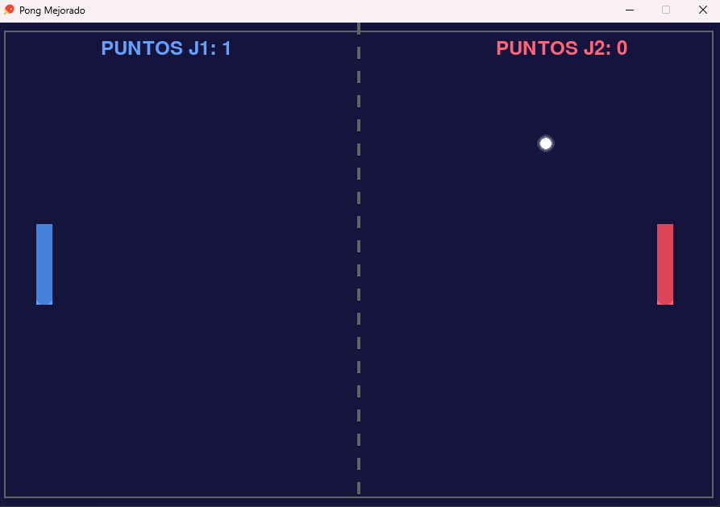

# Enhanced Pong with Pygame

A classic Pong game project, revitalized with modern visual/sound effects, game menus, and improved bounce physics. Created entirely in Python with the Pygame library.



---

## Key Features

-   **Classic Gameplay:** Control the paddles to compete against a second player.
-   **Interactive Menu:** A start menu to select the score limit to win the match (5, 10, or 50 points).
-   **Modern Visual Effects:**
    -   **Particles:** Particle explosions on every collision.
    -   **Screen Shake:** Subtle screen shakes when hitting the ball and scoring a point.
    -   **Polished Graphics:** Paddles with gradients and rounded corners, and a ball with a glow effect.
-   **Sound Effects:** Unique sounds for paddle hits, wall bounces, and scoring points.
-   **Improved Physics:** The ball's bounce angle depends on where it hits the paddle. The ball's speed progressively increases.
-   **State Management:** Pause screen, countdown before each serve, and a final winner screen with a "play again" option.

## How to Play

To run the game, you need to have Python and Pygame installed on your system.

### Prerequisites

-   **Python 3.x**
-   **Pygame**
    ```bash
    pip install pygame
    ```

### Running the Game

1.  Clone this repository:
    ```bash
    git clone [https://github.com/SimonDevJS/YOUR_REPOSITORY.git](https://github.com/SimonDevJS/YOUR_REPOSITORY.git)
    ```

2.  Navigate to the project folder:
    ```bash
    cd YOUR_REPOSITORY
    ```

3.  Run the Python script:
    ```bash
    python pong_enhanced.py
    ```

## Controls

-   **Player 1 (Blue Paddle):**
    -   `W` - Move Up
    -   `S` - Move Down
-   **Player 2 (Red Paddle):**
    -   `Up Arrow` - Move Up
    -   `Down Arrow` - Move Down
-   **Game:**
    -   `P` - Pause / Resume Game

## File Structure
```text
├── pong_enhanced.py      # Main game script
├── pong.png              # Window icon
├── golpe_paleta.mp3      # Sound for paddle hits
├── golpe_pared.mp3       # Sound for wall bounces
├── punto.mp3             # Sound for scoring a point
├── cuenta.mp3            # Sound for the countdown
├── inicio.mp3            # Sound for starting a round
└── scripts/              # (Directory for future scripts, currently empty)

